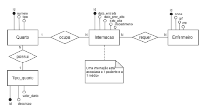

# Os Segredos do Hospital

No hospital, as internações têm sido registradas por meio de formulários eletrônicos que gravam os dados em arquivos. 

Para cada internação, são anotadas a data de entrada, a data prevista de alta e a data efetiva de alta, além da descrição textual dos procedimentos a serem realizados. 

As internações precisam ser vinculadas a quartos, com a numeração e o tipo. 

Cada tipo de quarto tem sua descrição e o seu valor diário (a princípio, o hospital trabalha com apartamentos, quartos duplos e enfermaria).

Também é necessário controlar quais profissionais de enfermaria estarão responsáveis por acompanhar o paciente durante sua internação. Para cada enfermeiro(a), é necessário nome, CPF e registro no conselho de enfermagem (COREN).

A internação, obviamente, é vinculada a um paciente – que pode se internar mais de uma vez no hospital – e a um único médico responsável.



## Resolução
```
# ----------- TIPO QUARTO ----------- 
create table if not exists tipo_quarto(
	id int primary key auto_increment,
    descricao varchar(200) not null,
    valor_diaria double not null
);

# ----------- QUARTO ----------- 
create table if not exists quarto(
	id int primary key auto_increment,
    numero int not null,
    tipo int,
    
    foreign key (tipo) references tipo_quarto(id) on delete cascade on update cascade
);

# ----------- INTERNAÇÃO ----------- 
create table if not exists internacao(
	id int primary key auto_increment,
    data_entrada date not null,
    data_prev_alta date not null,
    data_saida date not null,
    procedimento varchar (200),
    quarto int not null,
    paciente int not null,
    medico int not null,
    
    foreign key (quarto) references quarto(id) on delete cascade on update cascade,
    foreign key (paciente) references paciente(id) on delete cascade on update cascade,
    foreign key (medico) references medico(id) on delete cascade on update cascade
);

# ----------- ENFERMEIRO ----------- 
create table enfermeiro(
	id int primary key auto_increment,
    nome varchar(200) not null,
    cpf varchar(20) not null,
    crn varchar(20) not null
);

# ----------- INTERNACAO/ENFERMEIRO ----------- 
create table internacaoEnfermeiro(
	id_internacao int not null,
    id_enfermeiro int not null,
    
    foreign key (id_internacao) references internacao(id) on delete cascade on update cascade,
    foreign key (id_enfermeiro) references enfermeiro(id) on delete cascade on update cascade    
);
```
## Código completo
🔗<a href='SegredosHospital.sql'>SegredosHospital.sql</a>
